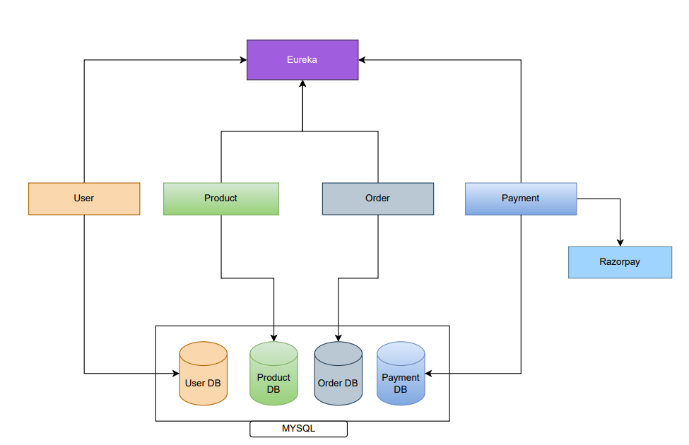

   # Ecommerce Backend Implementation:

This project implements the backend infrastructure for an Springboot based ecommerce application using Kubernetes Manifest file. It includes deployments for various **microservices**:
* **User**
* **Product**
* **Order**
* **Payment**

database setup using **StatefulSet** for MySQL, and ingress configuration for routing. The configurations are defined in YAML files for easy deployment and management.

This infrastructure setup enables scalable and efficient management of ecommerce application components. It provides a robust foundation for building a reliable and high-performance ecommerce platform.

Springboot based Microservice source code refer-> [Yovel](https://github.com/yovel86?tab=repositories)

## Architecture:




---------

## Deployment:


---------


### Deployment Instructions:


   Option 1: Manual Execution
   - Go through the [taskfile.yaml](https://github.com/Bhuvaneshwar-PH/Ecommerce-Backend-Implementation/blob/main/Taskfile.yaml) and execute the commands manually one by one in same format.


   Option 2:  
   - Install [Task](https://taskfile.dev/installation/) tasks and execute the following commands one by one in same folder where all file present:

    1. tasks 01-intial
    2. tasks 02-apply
    3. tasks 03-ingress
    4. tasks 04-delete

> Note: in Payment-dep.yaml we used Razorpay **Test** API .signup to razorpay and follow this [documentation](https://razorpay.com/docs/api/authentication/) and get id and secret and use that in env: 
----------

### API Documentation:

(use postman!!)

**User Microservice**

1. *Signup*

* **URL:** `http://<ip:port/dns>/users/signup`
* **Method:** `POST`
* **Body:**
    ```json
    {
    "name": "",
    "email": "",
    "password": ""
    }
    ```

2. *Login*

* **URL:** `http://<ip:port/dns>/users/login`
* **Method:** `POST`
* **Body:**
    ```json
    {
    "email": "",
    "password": ""
    }
    ```
    - Response:

    ```json
    {
    "token": ""
    }
    ```

> Note: Copy the token from the response and use it as the `Auth:token` header in subsequent requests to the Product, Order, and Payment microservices. 
----------


**Product Microservice**


* **URL:** `http://<ip:port/dns>/products`
* **Method:** `GET`
* **Header:** `Auth: <token>`
----------


**Orders Microservice**


* **URL:** `http://<ip:port/dns>/orders`
* **Method:** `POST`
* **Header:** `Auth: <token>`
* **Body:**

    ```json
    {
    "userId": ,
    "orderDetails": [
        {
        "productId": ,
        "quantity": 
        }
    ]
    }
    ```

----------
**Payments Microservice**


* **URL:** `http://<ip:port/dns>/payments`
* **Method:** `POST`
* **Header:** `Auth: <token>`
* **Body:**
    ```json
    {
  "userId": "",
  "orderId": ""
    }
    ```


----------
